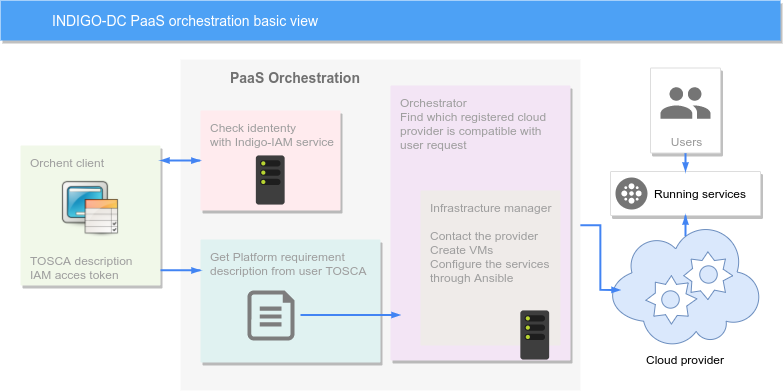

### [◀](README.md)

# Introduction to cloud platforms

When working with cloud resources, depending on the user needs, different layers of underlyng abstraction can be needed, and depending on how many layers and their composition one can define different categories.

[](img/platform-spectrum-small.png)

## Platform as a Service on top of Infrastracture as a Service

[](img/PaaS-IaaS.png)

Infrastructure as a service (IaaS)  is __a cloud computing offering in which a vendor provides users access to computing resources such as servers__, storage and networking. Organizations use their own platforms and applications within a service provider’s infrastructure.

Key features:

- Instead of purchasing hardware outright, users pay for IaaS on demand.
- Infrastructure is scalable depending on processing and storage needs.
- Saves enterprises the costs of buying and maintaining their own hardware.
- Because data is on the cloud, there can be no single point of failure.
- Enables the virtualization of administrative tasks, freeing up time for other work.

Platform as a service (PaaS) is __a cloud computing offering that provides users with a cloud environment in which they can develop, manage and deliver applications.__ In addition to storage and other computing resources, users are able to use a suite of prebuilt tools to develop, customize and test their own applications.

Key features:

- SaaS vendors provide users with software and applications via a subscription model.
- Users do not have to manage, install or upgrade software; SaaS providers manage this.
- Data is secure in the cloud; equipment failure does not result in loss of data.
- Use of resources can be scaled depending on service needs.
- Applications are accessible from almost any internet-connected device, from virtually anywhere in the world.

__N.B. In this hands-on a simple VM will be deployed, as an example, on cloud resources in an automated way thanks the use of a PaaS orchestrator and TOSCA system description files. More complicated recipices can provide you with a working k8s cluster where you can setup a FaaS framework as you will use in the next chapters.__


## INDIGO-DC PaaS orchestrator

[](img/sosc-indigo.png)

[The INDIGO PaaS Orchestrator](https://github.com/indigo-dc/orchestrator) allows to instantiate resources on Cloud Management Frameworks (like OpenStack and OpenNebula) platforms based on deployment requests that are expressed through templates written in [TOSCA YAML Simple Profile v1.0](https://docs.oasis-open.org/tosca/TOSCA-Simple-Profile-YAML/v1.0/csprd01/TOSCA-Simple-Profile-YAML-v1.0-csprd01.html), and deploys them on the best cloud site available.

### Requirement

- First of you need to register to the service as described [here](https://dodas-iam.cloud.cnaf.infn.it). *N.B.* please put in the registration note "SOSC2019 student". Requests without this note will not be accepted. Please also notice that the resources instantiated for the school will be removed from the test pool few days after the end of the school.

### Install deployment client

```bash
sudo apt install -y jq unzip
wget https://github.com/Cloud-PG/dodas-go-client/releases/download/v0.2.2/dodas.zip
unzip dodas.zip
sudo mv dodas /usr/local/bin/
```
