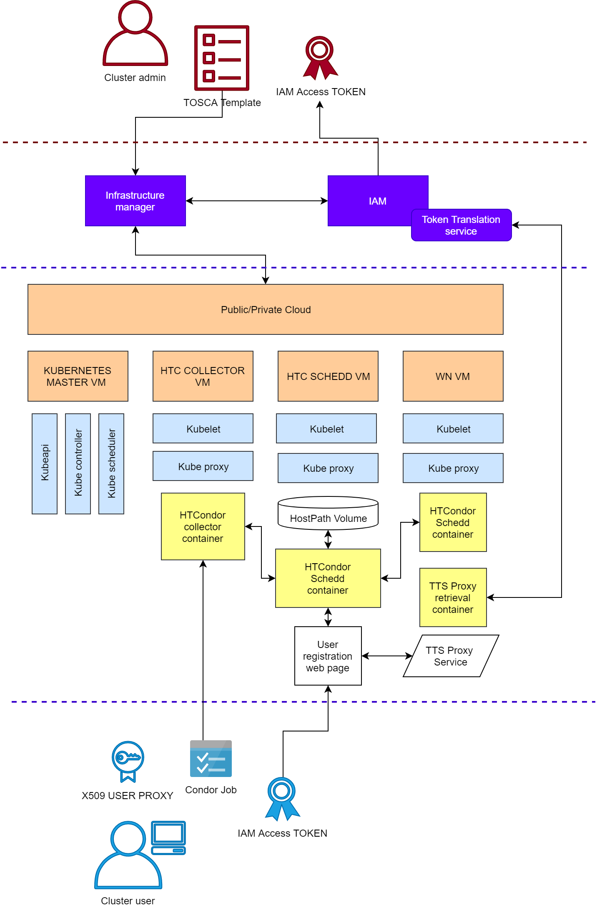
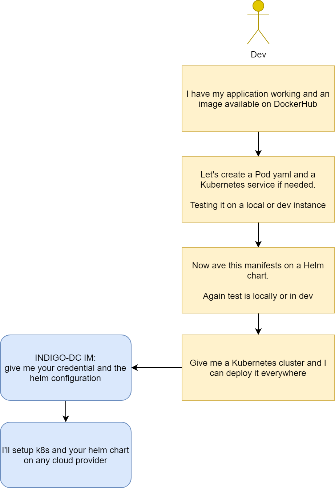

# HTCondor on demand 

## Deployment schema



### AuthN/Z schema


## Automation flow



## Deploying HTCondor on demand 

### Retrieve IAM token

``` bash
$HOME/get_proxy.sh
```

You'll be prompted with username and password requests. Just insert the one corresponding to you Indigo-IAM account.


### Method 1: Deployment with orchestrator

#### Get the templates

[Template for HTC cluster on demand with orchestrator](https://gist.githubusercontent.com/dciangot/cf43757f23fa33742cd7c0704152ab34/raw/032524775ef72db5ec1068ed01351293b1b534ef/condor_orchestrator.yaml)

#### Quick look at ansible

[HTCONDOR cluster Ansible](https://github.com/indigo-dc/ansible-role-htcondor_config/blob/v2.0.0-dodas-rc1/tasks/main.yml)

#### Fill the missing parameters

....

#### Deploy

After using the `$HOME/get_proxy.sh` script to retrieve the token, export it into an env variable together with the orchestrator endpoint:

```bash
export ORCHENT_TOKEN=<your token here>
export ORCHENT_URL=https://dodas-paas.cloud.ba.infn.it/orchestrator
```

```bash
orchent depcreate condor_orchestrator.yaml '{}'
```

#### Log into k8s master

Get the private key for the master node key:

```bash
orchent depshow <UUID>
```

Then log in with:

```bash
chmod 600 mykey
ssh -i mykey k8s_master
```

### Method 2: Deployment with IM DODAS

#### Get the templates

[Template for k8s cluster](https://raw.githubusercontent.com/indigo-dc/tosca-templates/k8s_cms/dodas/Kubernetes.yaml)

[Template for HTC cluster](https://raw.githubusercontent.com/indigo-dc/tosca-templates/k8s_cms/dodas/htcondor_k8s-cluster.yaml)

[DODAS templates repo](https://github.com/indigo-dc/tosca-templates/tree/k8s_cms/dodas)

#### Fill the missing parameters

....

#### Validate the template

#### Deploy

After using the `$HOME/get_proxy.sh` script to retrieve the token and to configure the dodas client:

```bash
dodas create htcondor_k8s-cluster.yaml
```

#### Log into k8s master

Get the private key for the master node key:

```bash
dodas get vm <infID> 0
```

Then log in with:
