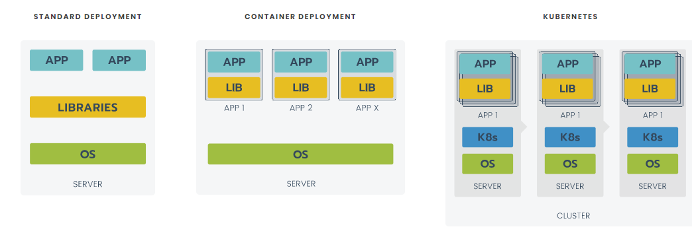
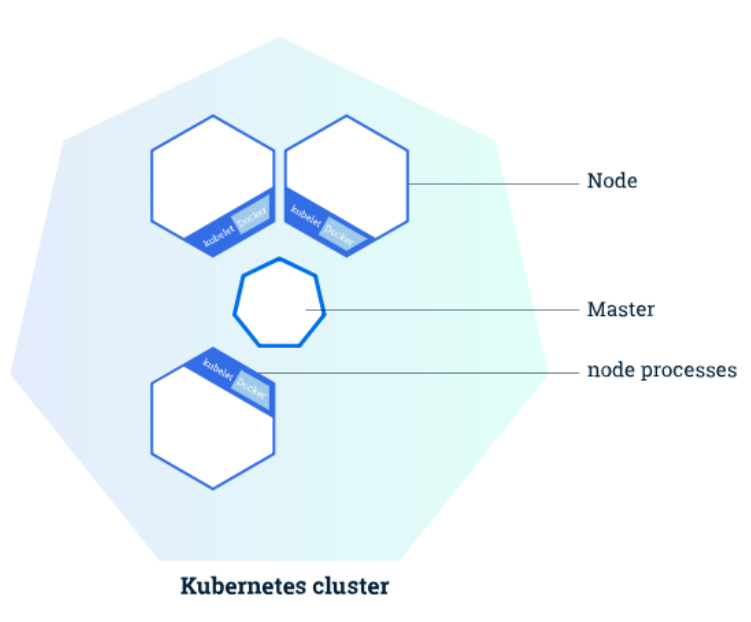

# Why Kubernetes?

## The evolution of server setups

[Kubernetes](https://kubernetes.io) is an open-source platform that coordinates a highly available cluster of computers that are connected to work as a single unit. Kubernetes automates the distribution and scheduling of application containers across a cluster in a fairly efficient way. A cluster can be deployed on either physical or virtual machines.

## What will Kubernetes do for you?

- APIs:
    - Kubernetes is driven by its API. Your CI/CD system can communicate with Kubernetes via its REST and CLI interfaces to carry out actions within the cluster. You can build staging environments. You can automatically deploy new releases.
- Failure recovering:
    - Kubernetes monitors the containers running within it, performing readiness and health checks via TCP, HTTP, or by running a command within the container. Only healthy resources receive traffic, and those that fail health checks for too long will be restarted by Kubernetes or moved to other nodes in the cluster.
- Scale automatically.
- Born with microservices in mind.
- Declarative model:
    - The Kubernetes model is declarative. You create instructions in YAML that tell it the desired state of the cluster. It then does what it needs to do to maintain this state. 
- Kubernetes is everywhere:
    - You can run it on bare metal servers or in a private cloud. You can run it on the public cloud. You can run applications within a hosted Kubernetes service.
    - You can also create a local dev cluster in few steps with many solutions:
        - [k3d](https://github.com/rancher/k3d)
        - [minikube](https://kubernetes.io/docs/tasks/tools/install-minikube/)

## Kubernetes architecture in  a nutshell

- The Kubernetes Master is a collection of three processes that run on a single
node in your cluster, which is designated as the master node. These processes
are:
    - kube-apiserver
    - kube-controller-manager
    - kube-scheduler
- Each individual Node in your cluster runs two processes:
    - kubelet, which communicates with the Kubernetes Master.
    - kube-proxy, a network proxy which reflects Kubernetes networking services on each node.

Moreover, each Node runs a container runtime (like Docker) responsible for
pulling the container image from a registry, unpacking the container, and running
the application.

