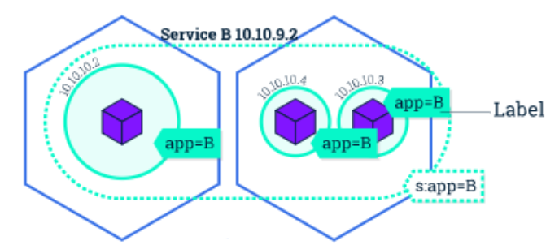

# Exposing applications in pod

We can create a reliable way to access the enpoint inside a pod using the `service` k8s resource:

- A service is an abstraction for pods, providing a stable, so called virtual IP (VIP) address. While __pods may come and go and with it their IP addresses, a service allows clients to reliably connect to the containers running in the pod using the VIP__. 
    - The virtual in VIP means it is not an actual IP address connected to a network interface, but its purpose is purely to __forward traffic to one or more pods.__
    - Keeping the mapping between the VIP and the pods up-to-date is the job of __kube-proxy, a process that runs on every node,__ which queries the API server to learn about new services in the cluster.



## Type of services

### ClusterIP

### NodePort

## Associating ExternalIPs


## Create a service

First create a labelled pod:

```bash
```

The let's take a look to the yml file for creating a service:

```yaml
apiVersion: v1
kind: Service
metadata:
  name: simpleservice
spec:
  ports:
    - port: 80
      targetPort: 9876
    externalIPs: 193.XXXXXXX
  selector:
    app: myapp
```

[TODO: open ports]

Now create a service executing:

```bash

```


## Extras

### Using NodePort


### Ingress Controllers
