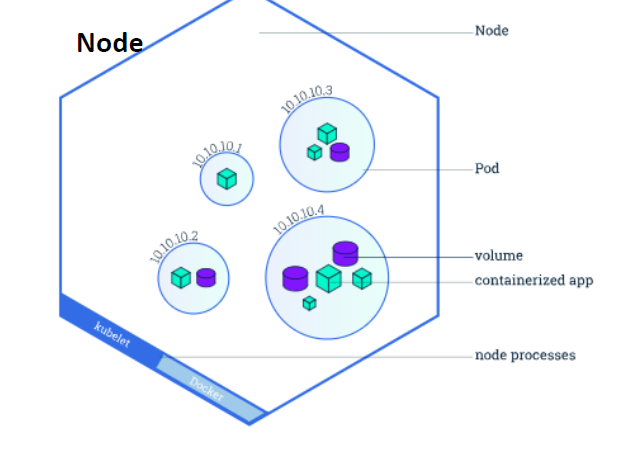

# Using Kubernetes volumes

## Why?
As we have already seen, on-disk files within a container are
ephemeral. This presents some problems for non-trivial applications
when running in containers.
- When a Container crashes, kubelet will restart it, but the internal container
files will be lost - the Container starts with a clean state.
- When running Containers together in a Pod it is often necessary to share files
between those Containers.
- The Kubernetes Volume abstraction solves both of these problems.

## Volumes

A Kubernetes volume is essentially a directory accessible to all containers running in a pod. In contrast to the container-local filesystem, the data in volumes is preserved across container restarts. The medium backing a volume and its contents are determined by the volume type:

- node-local types such as `emptyDir` or `hostPath`
- file-sharing types such as `nfs`
- cloud provider-specific types like `awsElasticBlockStore`, `azureDisk`, or `gcePersistentDisk`
- distributed file system types, for example `glusterfs` or `cephfs`
special-purpose types like secret, `gitRepo`
- a special type of volume called `PersistentVolume`, see [HERE]

### Create a node-local volume with emptyDir

### Share a secret across pods

